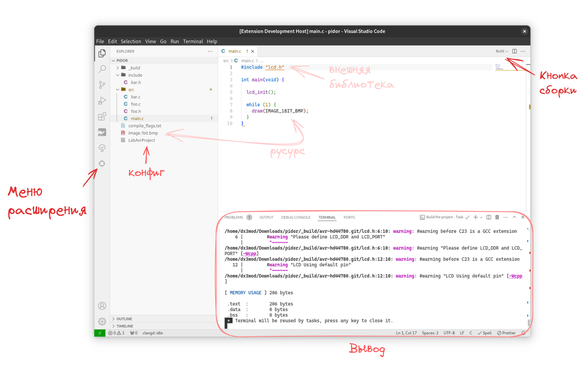

# LabAvrPlatform

Lab-based platform for organizing full-featured development for AVR microcontrollers in C, C++ and assembly languages.

This is an extension to VSCode to integrate the [bavar][bavar] build system.

#### Integrated functionality

- Project creation
- Build and upload commands
- Choosing between Microsoft C/C++ Extension or Clangd

## Preview

## Installation

🚧 Now only works on Unix-like systems!

- [Requirements](https://github.com/dx3mod/bavar/blob/master/README.md#installation)

#### Prebuilt binaries

To get prebuilt binaries, see the [releases page](https://github.com/dx3mod/LabAvrPlatform/releases).

[bavar]: https://github.com/dx3mod/bavar
