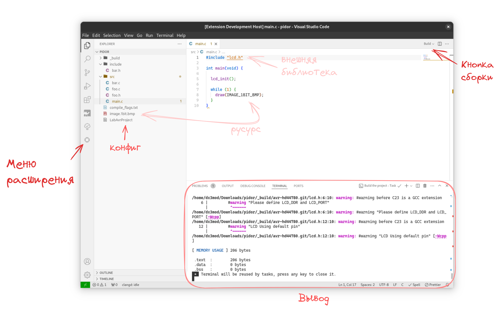

# LabAvrPlatform
<!-- Lab-based development platform for AVR C/C++ projects. -->

Лабораторная платформа для организации полнофункциональной разработки под микроконтроллеры AVR на языках программирования C, C++ и ассемблер.

Представляет из себя интеграционное решение, состоящие из [самодостаточной системы сборки][bavar] и [расширения к текстовому редактору](./vscode-extension/) для её интеграции.

## Особенности

- ✍️ Диктуемая организация проекта (с отсутствием boilerplate конфигурации)
- 🏗️ Сборка с разрешением внешних зависимостей 
    + Автовключение файлов (единое пространство имён)
    + Бандлинг ресурсов в прошивку
- 🔌 Загрузка прошивки на МК (powered by avrdude)

## Установка

- [Бинарный дистрибутив](https://github.com/dx3mod/LabAvrPlatform/releases)

<!-- ## Документация

- [Веб-страница проекта](https://labavrplatform.vercel.app/)
- Для разработчиков -->

[bavar]: https://github.com/dx3mod/bavar